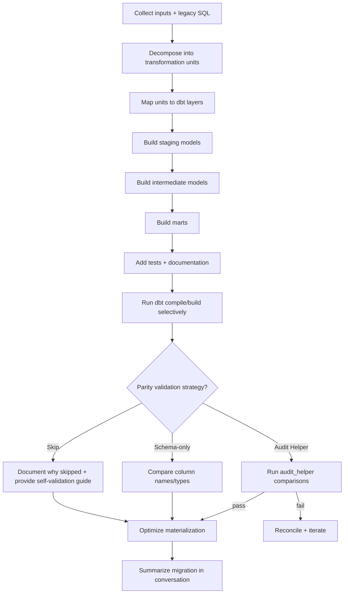

# Migrating Legacy SQL / Stored Procedures to dbt

Migrate stored procedures and legacy SQL scripts into a well-structured dbt project by decomposing procedural logic into modular, testable, well-documented dbt models.

## When to Use

- You have a stored procedure (or "job step" SQL) and want to migrate it into dbt models or macros
- You're modernizing imperative ETL logic into a layered dbt project (staging → intermediate → marts)
- You need to refactor monolithic SQL into modular, testable transformations
- You need to replace MERGE / UPSERT / temp-table logic with dbt incremental patterns

Not for: debugging parsing, compilation, or runtime errors in an existing dbt project.

## Reference Guides

This skill includes detailed reference guides. Read the relevant guide as needed:

| Guide | Use When |
|------|----------|
| `references/planning-and-decomposition.md` | Turning a stored procedure into a DAG of dbt models |
| `references/legacy-patterns-to-dbt.md` | Translating temp tables, MERGE/UPSERT, loops, IF/ELSE, dynamic SQL |
| `references/incremental-and-upserts.md` | Choosing incremental strategies and handling late-arriving data |
| `references/parity-validation.md` | Proving semantic equivalence with legacy outputs |
| `references/stored-procedure-migration-guide.md` | Following official dbt Labs migration guidance |

## The Iron Rules

1) **Do not migrate 1:1 as a single giant model.**
2) **Think declaratively, not procedurally.**
3) **Use `source()` only in staging; use `ref()` everywhere else.**
4) **Staging models are 1:1 with sources and do not join or aggregate.**
5) **Preserve semantics before optimizing.**
6) **Never claim success without parity validation (or documenting why it was skipped).**
7) **All generated SQL models and YAML must follow the dbt-fusion spec** to ensure compatibility with the dbt-fusion engine.

## Inputs to Request Up Front

Ask the user for:

- Stored procedure / legacy SQL text (including dependencies)
- Source tables/views read from and targets written to
- Final output grain and primary key(s)
- Incremental / CDC assumptions:
  - updated_at or event_ts
  - unique key and dedupe rules
  - late-arriving data expectations
- Scheduling expectations and SLAs
- dbt project context:
  - warehouse
  - naming conventions
  - folder structure
  - existing `sources.yml` patterns
- Parity validation strategy (pick one):
  1. **Audit Helper** — Full data comparison using `dbt-audit-helper`. Requires warehouse access to legacy output tables.
  2. **Schema-only** — Compare column names/types against user-provided DDL or documentation. Use when there is no access to legacy data.
  3. **Skip** — Skip parity validation entirely. Provide documentation on how the user can validate on their own later.

If information is missing, document assumptions explicitly.

## Workflow



## Interacting with the CLI (Required)

Work iteratively and validate assumptions:

```bash
dbt show --select <model_or_source> --limit 20
dbt compile --select <model>
dbt build --select +<model>
dbt ls --select <selector>
```

Avoid running the full project unless explicitly requested.

## Step 1: Decompose the Stored Procedure

Follow `references/planning-and-decomposition.md`.

Break the procedure into discrete transformation units.
Each unit should map to one dbt model.

## Step 2: Map Units to dbt Layers

**Staging:** rename, cast, categorize (1:1 with sources)

**Intermediate:** joins, dedupe, enrichment, aggregation

**Marts:** business entities at a clear grain

## Step 3: Folder and Naming Conventions

### Folders

All migrated models go under a `migration/` folder to keep them separate from any existing project models:

- `migration/models/staging/<source_system>/`
- `migration/models/intermediate/<domain>/`
- `migration/models/marts/<domain>/`

### Naming

- **staging:** `stg_<source>__<entity>s`
- **intermediate:** `int_<entity>s_<verb>`
- **marts:** plural business entities

## Step 4: Translate Legacy Patterns

Use `references/legacy-patterns-to-dbt.md`.

Treat `run_query()` as a last resort, not a default tool.

## Step 5: Incremental Models (If Needed)

Use `references/incremental-and-upserts.md`.

Incremental models must be deterministic, have a defined unique key, and document late-arriving data handling.

## Step 6: Tests and Documentation

Minimum bar:

- `unique` + `not_null` tests on mart primary keys
- `relationships` tests where applicable
- model and key column descriptions

## Common Mistakes

- Migrating everything into one model
- Using `source()` outside staging
- Overusing `var()` to mimic stored procedure parameters
- Using `run_query()` for business logic
- Skipping validation

## Red Flags — STOP

- Claiming parity without evidence
- Incremental without a unique key
- Dynamic SQL implemented in Jinja
- Undefined grain for a mart

## Output Expectations

Provide:

- Legacy → dbt mapping
- New or updated models and YAML
- Parity validation summary
- Materialization rationale

All generated SQL and YAML must be compatible with the dbt-fusion engine. Do NOT create standalone markdown files (e.g. migration reports). Summarize findings directly in the conversation.